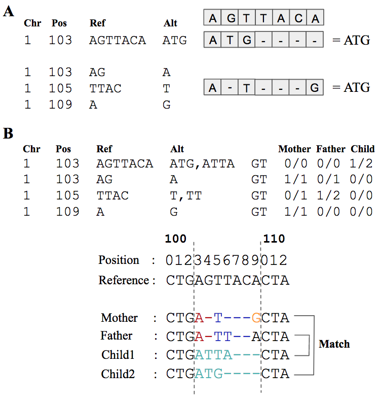

# VBT - MENDELIAN VIOLATION DETECTOR
**Author:** Berke Cagkan Toptas

Many tools exists to count Mendelian violations in family trios using the naive variant comparison method where variants at same locations are compared. Naive variant comparison however, fails to assess regions where multiple variants need to be examined together. This reduces the accuracy of existing Mendelian violation checking tools.

<p align="center">
  
</p>

Variants can be represent with different ways due to the current VCF file standard and repetitive structure of human genome. In **Figure A**, an example is provided where a small INDEL can be represented as 3 variants. This representation issues often cause wrong Mendelian decision assessment in naive variant comparison. In **Figure B**, an example is given where naive tools marks all 4 variants as Mendelian violation. However, when we apply them to the reference sequence, a possible combination can be found where none of them are Mendelian violation.

With VBT, we aim to resolve variant representation issues in family trios and perform more accurate trio analysis for several purposes including benchmarking and de novo mutation identification. VBT uses an improved version of [vcfeval](https://github.com/RealTimeGenomics/rtg-tools) and uses [htslib](https://htslib.org) to read/write VCF and FASTA files.


## Parameter Format:

```
./vbt mendelian -father <father_vcf_path> -mother <mother_vcf_path> -child <child_vcf_path> -ref <reference_fasta> -outDir <output_directory> [OPTIONAL PARAMETERS]
```

## Command line parameters:
**Warning:** Parameters are **case sensitive!**


### --help
A **single** parameter which prints all parameter options to the console. (./vbt mendelian --help)


### -father father_vcf_path

A **required** parameter which specifies the father vcf file path. It supports both bcf and vcf file formats. If given vcf contain multiple samples, first sample will be taken by default unless a Pedigree file is provided (see -pedigree command)


### -mother mother_vcf_path

A **required** parameter which specifies the mother vcf file path. It supports both bcf and vcf file formats. If given vcf contain multiple samples, first sample will be taken by default unless a Pedigree file is provided (see -pedigree command)

### -child child_vcf_path

A **required** parameter which specifies the mother vcf file path. It supports both bcf and vcf file formats. If given vcf contain multiple samples, first sample will be taken by default unless a Pedigree file is provided (see -pedigree command)

### -ref reference_fasta_path

A **required** parameter which specifies the reference FASTA file path. It should be in FASTA (.fa) format. A FASTA index file is not mandatory. The tool will automatically generate a FASTA index file (.fai) if it does not exist.

### -no-call nocall_mode

An **optional** parameter which sets the way program process no call variants. Default mode is none.

**explicit :** Marks noCall(variants with ./. genotype) variants as NoCall (Parent nocall or child nocall)
**none     :** Process noCall sites as 0/0 HOMREF

### -outDir output_directory_path

A **required** parameter which specifies the output directory for program/error logs and ga4gh output vcf file. In current version, in order not to damage multiplatform capability, **directory should exist. VBT will not generate a directory for different Operating System compatibility reasons**.


### -pedigree PED_file_path


An **optional** parameter which is used to determine all 3 samples from a PED file. Is useful where input vcf files contain more than 1 sample

### --autosome-only

An **optional** parameter which is used to process only autosomes [chr1:chr22] By default, it is set to FALSE. Note that in order to use this parameter, the chromosome naming should be either 1,2,3 etc. or chr1, chr2, chr3. For other chromosome namings, please use -bed command to specify autosomes.

### -bed BED_file_path

An **optional** parameter which is used to select regions from VCF file.


### -filter filter_name

An **optional** parameter which is used to filter variants with given filter name. Filter name should be same in baseline and called variants. By default, **PASS filtering** is applied to the variants. In order to disable filtering, **'-filter none'** should be used.


