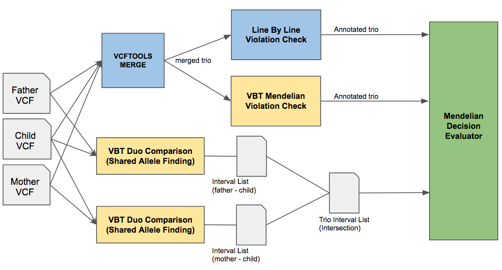

# VBT REGION BASED MENDELIAN VIOLATION VALIDATOR

*Below, we detailed our Benchmarking strategy of VBT. Please let us know, for any problems you have encountered during reproduction of VBT benchmarking data.*
 
 
To our knowledge, there is no truth dataset available for Mendelian violations in a family trio. For this reason, we developed VBT violation validator tool in order evaluate VBT Mendelian violation decisions and compare the results with naive methods.

Our tool provides a comparative analysis between the results of given two Mendelian violation identification tools. Rather than seeking for the ground truth, our tool analyze violation calls of the 2 tool and evaluates which of the decision is likely be true.

We designed VBT Validator as a pipeline with few basic steps as shown in below figure:

  

Naive trio analysis tools does not accept single sample vcf files as input therefore, we first merge the individual mother, father and child samples using [Vcftools](https://vcftools.github.io/) vcf-merge with following command:

	./vcf-merge  --ref-for-missing 0/0 mother.vcf.gz father.vcf.gz child.vcf.gz   > trio.merged.vcf
	
Once we obtained the merged trio, we pass it to Naive Line-by-Line violation check tool and VBT as input. For simplicity, we implemented a naive trio mendelian violation identification tool that produces an annotated trio as output. Both VBT and the Naive tool uses identical "MD" (Mendelian Decision) annotation where 1 means the record is consistent and 2 means the record is violation.

We also provide the naive violation checking tool under this folder which produces the annotated trio vcfs. We run this tool with the following command:

	./naive-mendelian  trio.vcf trio.ped output_trio_name

Our Mendelian decision evaluator tool takes the two annotated trio vcfs from different tools as input and for each violation decision, it checks whether the decision is correct comparatively between two trios. Basically, this tool apply variants to the reference sequence in all possible combinations and then checks if mother, father and child sample form a Mendelian consistent sequences.

In a typical whole genome family trio, there are many variants (> 1x10e6) per sample which is immpossible to generate all possible combinations. (Total combination count would be  10e6 x 10e6 x 10e6 = 10e18!!) Instead, we use the dynamic programming solution introduced by [vcfeval](https://github.com/RealTimeGenomics/rtg-tools) for dividing all variants into smaller regions where variants in a region can be processed independently from other regions. We use the definition of **syncpoints** from [vcfeval paper](https://www.biorxiv.org/content/early/2015/08/03/023754). Syncpoints are intermediate results of variant comparison algorithms which divides VCF files into small sets which are consist of 1 to 100 variants (less than 20 on average). Once we separate the variants, it enables us to generate all possible combinations for each region by applying variants to the reference sequence.

In order to obtain **syncpoints**, we added an extra mode to our vcfeval implementation that produces all syncpoints as a text file. For this purpose we run the following two commands in VBT:

	./vbt varcomp -base mother.vcf -called child.vcf -ref reference.fasta -outDir output --trim-endings-first --generate-sync-point
	./vbt varcomp -base father.vcf -called child.vcf -ref reference.fasta -outDir output --trim-endings-first --generate-sync-point

We get the sync points between mother&child samples and father&child samples. Finally, using the two syncpoint text files, the output annotated trios from VBT and naive tools and the reference FASTA, we run our Mendelian decision evaluator using the following command:

	./vbtvalidate -input-vbt-trio vbtTrio.vcf -input-orignal-trio naiveTrio.vcf -reference reference.fasta -mother-child-interval motherchild_intervals.txt -father-child-interval fatherchild_intervals.txt -ped-file trio.ped
	
Our tool return results similar to below (The below result belongs to [1000g-phase3](ftp://ftp.1000genomes.ebi.ac.uk/vol1/ftp/phase3/data) CEU bam files called with Freebayes using default parameters):

	VBT DECISION EVALUATOR VERSION : 2.0.1
	[STDOUT] VBT Validator (region based)
	Total Region Count   : 164050
	VBT Correct Interval                     : 161772
	VBT Wrong   Interval (Missing Violation) : 876
	VBT Wrong   Interval (Extra Violation  ) : 446
	LBL Correct Interval                     : 123125
	LBL Wrong   Interval (Missing Violation) : 18656
	LBL Wrong   Interval (Extra Violation  ) : 21313
	VBT Precision : 0.997251
	VBT Recall    : 0.994614
	LBL Precision : 0.852442
	LBL Recall    : 0.868417
	VBT Accuracy : 0.991894
	LBL Accuracy : 0.754933

More detailed explanation of how our Mendelian decision evaluator works can be found at Supplementary Text of [VBT Preprint](https://www.biorxiv.org/content/early/2018/01/24/253492).

